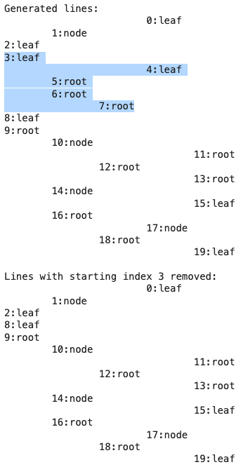

# Tree Pruning
Python script to generate and prune a tree-like structure represented as indented text lines.

## Overview
Generates a list of lines representing a tree structure, where indentation levels indicate depth. Creates a tree-like structure with root, node, and leaf labels at varying indentation levels.

Indentation as a Tree Structure
Each line represents a node, and its depth in the hierarchy is indicated by the number of tab characters (\t).
This mimics how trees are often visually represented.

### Efficient Pruning Using Tab Counts
Provides a function to remove a subtree starting from a given index. Removes a subtree starting from a specified line index, ensuring all children of that node are also deleted.

The function `remove_lines(lines, start_index)`:
Identifies the indentation level of the node at start_index.
Iterates through subsequent lines, deleting nodes until reaching a sibling or a parent node.
This ensures that all children of the pruned node are removed without explicitly constructing a tree structure in memory.

Avoiding Explicit Tree Construction
A traditional tree would require creating Node objects and maintaining parent-child relationships.
This method skips that overhead by using simple string operations, making it lightweight and easy to implement.

The tree pruning problem is in the segment / section and determined by the number of tabs, i.e. 2.2.2.1 [tab, tab].[tab, tab].[tab, tab].[tab]

### Use Case: Pruning a Text-Based Outline
If you were working with structured logs, YAML-like data, or an outline-style document, this approach would allow easy removal of sections.

